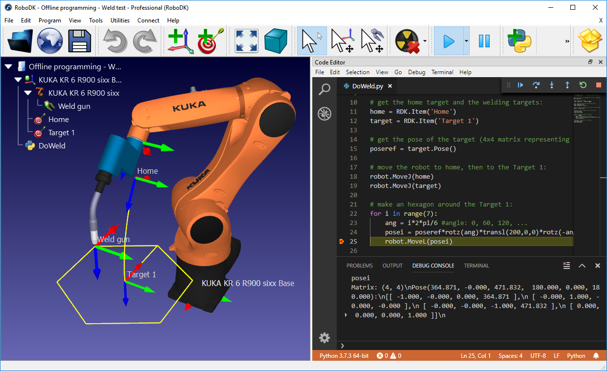

RoboDK API for Python
=======================

Introduction
--------------
The `robodk` package implements the [RoboDK API for Python](https://robodk.com/doc/en/PythonAPI/index.html).

This package allows you to interact with RoboDK software for simulation and programming industrial robots. With the RoboDK API for Python it is possible to simulate and program any industrial robot using Python programming language. The RoboDK API provides an alternative to using vendor-specific programming languages.

While RoboDK's graphical user interface can be used to create programs, it is possible to extend the robot controller limitations by using a universal programming language such as Python.
The following page provides an overview of the RoboDK API for Python: <https://robodk.com/offline-programming>.

The `robodk` package is available on [PyPi](https://pypi.python.org/pypi/robodk/).



RoboDK can be used for a wide range of applications, such as 3D printing, robot machining, synchronizing multiple robots, pick and place, and so on. The `robodk` package provides tools to ease the development of such applications.


Documentation
---------------

The `robodk` package includes the following modules:

* The [`robolink` module](https://robodk.com/doc/en/PythonAPI/robodk.html#robolink-py) is the link between RoboDK and Python. Any item from the RoboDK item tree can be retrieved. Items are represented by the object Item. An item can be a robot, a reference frame, a tool, an object or a specific project.
* The [`robomath` module](https://robodk.com/doc/en/PythonAPI/robodk.html#robomath-py) is a robotics toolbox, inspired from [Peter Corke’s Robotics Toolbox](https://petercorke.com/toolboxes/robotics-toolbox/). For instance, matrix operations, projection, timers, etc.
* The [`robodialogs` module](https://robodk.com/doc/en/PythonAPI/robodk.html#robodialogs-py) is a dialogs toolbox. For instance, open and save file dialogs, message prompts, etc.
* The [`robofileio` module](https://robodk.com/doc/en/PythonAPI/robodk.html#robofileio-py) is a file operation toolbox. File properties, CSV, FTP, etc.
* The [`roboapps` module](https://robodk.com/doc/en/PythonAPI/robodk.html#roboapps-py) is a RoboDK Apps toolbox. More information can be found in our [App loader documentation](https://github.com/RoboDK/Plug-In-Interface/tree/master/PluginAppLoader).


You can find more information about RoboDK API in our documentation.
 * [RoboDK API documentation](https://robodk.com/doc/en/RoboDK-API.html#PythonAPI)
 * [The `robodk` package for Python](https://robodk.com/doc/en/PythonAPI/index.html)
 * [Introduction to RoboDK for robot simulation and offline programming](https://robodk.com/offline-programming)


Requirements
------------
* [Python](https://www.python.org/downloads/) (Python 2 and Python 3 supported)
* [RoboDK](https://robodk.com/download)

Mac and Linux usually have Python 2 installed by default. Although it is not required, Python 3 can be installed on Linux by typing:
```
sudo apt-get install pip3
sudo apt-get install idle3
```


How to install
-------------------
By default, RoboDK automatically uses the `PYTHONPATH` environment variable pointing to the `/RoboDK/Python/` folder to search for the `robodk` package. Alternatively, you can also install the `robodk` package for Python:
```
# cd path-to-python/Scripts
pip install robodk
```

RoboDK will automatically install external Python dependencies based on your usage. However, if you do not have an active ethernet connection or wish to install them all at once, you can specify external dependencies (see extras_require in [setup.py](./setup.py)):
```
# cd path-to-python/Scripts
pip install robodk[cv,apps,lint]
```

The Python interpreter and editor used by RoboDK can be set in:
>RoboDK &rarr; Tools &rarr; Options &rarr; Python

Example
------------

The following script shows an example that uses the `robodk` package for robot simulation and offline programming. For more examples using the API, see our [documented examples](https://robodk.com/doc/en/PythonAPI/examples.html).

```python
from robodk.robolink import *      # RoboDK's API
from robodk.robomath import *      # Math toolbox for robots

# Start the RoboDK API:
RDK = Robolink()

# Get the robot item by name:
robot = RDK.Item('Fanuc LR Mate 200iD', ITEM_TYPE_ROBOT)

# Get the reference target by name:
target = RDK.Item('Target 1')
target_pose = target.Pose()
xyz_ref = target_pose.Pos()

# Move the robot to the reference point:
robot.MoveJ(target)

# Draw a hexagon around the reference target:
for i in range(7):
    ang = i*2*pi/6 #ang = 0, 60, 120, ..., 360

    # Calculate the new position around the reference:
    x = xyz_ref[0] + R*cos(ang) # new X coordinate
    y = xyz_ref[1] + R*sin(ang) # new Y coordinate
    z = xyz_ref[2]              # new Z coordinate
    target_pos.setPos([x,y,z])

    # Move to the new target:
    robot.MoveL(target_pos)

# Trigger a program call at the end of the movement
robot.RunCode('Program_Done')

# Move back to the reference target:
robot.MoveL(target)
```

Posts-processors
------------------

The same script used for simulation can be used for robot programming offline. This means a program will be automatically generated for your robot controller to reproduce the movements on the robot.
RoboDK supports a large number of robot controllers and it is easy to include compatibility for new robot controllers using Post Processors.

More information about robot post-processors here:

* https://robodk.com/help#PostProcessor
* https://robodk.com/doc/en/Post-Processors.html
* https://robodk.com/doc/en/PythonAPI/postprocessor.html


You can find the most up to date list of supported robot controllers in our documentation for [Posts-processors](https://robodk.com/doc/en/Post-Processors.html#AvailablePosts).

<details>
<summary>Preview of supported robot controllers</summary>

* ABB RAPID IRC5: for ABB IRC5 robot controllers
* ABB RAPID S4C: for ABB S4C robot controllers
* Adept Vplus: for Adept V+ programming language
* Allen Bradley Logix5000: for Allen Bradley Logix5000 PLC
* Aubo: for AUBO robot controllers
* CLOOS: for CLOOS robot controllers
* Comau C5G: for Comau C5G robot controllers
* Denso PAC: for Denso RC7 (and older) robot controllers (PAC programming language)
* Denso RC8: for Denso RC8 (and newer) robot controllers (PacScript programming language)
* Dobot: for educational Dobot robots
* Doosan: for Doosan collaborative robots
* Epson: for Epson robot controllers
* Fanuc R30iA: for Fanuc R30iA and R30iB robot controllers
* Fanuc R30iA_Arc: for Fanuc Arc welding
* Fanuc RJ3: for Fanuc RJ3 robot controllers
* GCode BnR: for B&R robot controllers
* GSK: for GSK robots
* HCR: for Hanwha robot controllers
* HIWIN HRSS: for HIWIN robots
* Hyundai: for Hyundai robot controllers
* KAIRO: for Keba Kairo robot controllers
* Kinova: for Kinova robots
* Kawasaki: for Kawasaki AS robot controllers
* KUKA IIWA: for KUKA IIWA sunrise programming in Java
* KUKA KRC2: for KUKA KRC2 robot controllers
* KUKA KRC2_CamRob: for KUKA CamRob milling option
* KUKA KRC2_DAT: for KUKA KRC2 robot controllers including DAT data files
* KUKA KRC4: for KUKA KRC4 robot controllers
* KUKA KRC4_Config: for KUKA KRC4 robot controllers with configuration data in each line
* KUKA KRC4_DAT: for KUKA KRC4 robot controllers including DAT data files
* Mecademic: for Mecademic’s script code required by the Meca500 robot
* Mecademic Python: it generates a Python script that can control the Mecademic Meca500 robot remotely.
* Mitsubishi: for Mitsubishi robot controllers
* Motoman/Yaskawa: for different Motoman robot controllers using Inform II and Inform III (JBI)
* Nachi AX FD: for Nachi AX and FD robot controllers
* Omron: for Omron/Techman robot controllers
* OTC: for Daihen OTC robot controllers
* Panasonic: For Panasonic PRG programs (requires Panasonic G2PC tools to compile ASCII files to binary files)
* Precise: for Precise Scara robots
* Robostar: for Robostar robot controllers
* Siasun: for Siasun robot controllers
* Siemens_Sinumerik: for Siemens Sinumerik ROBX robot controller
* Staubli VAL3: to generate Staubli VAL3 robot programs (CS8 controllers and later). It inlines the robot movements.
* Staubli VAL3_Machining: for Staubli VAL3 controllers that have the Machining HSM option.
* Staubli S6: for Staubli S6 robot controllers
* Toshiba: for Toshiba robots
* Techman: for Omron/Techman robot controllers
* Universal Robots: for UR robots, it generates linear movements as pose targets
* Universal Robots URP: for UR robots, it generates a URP that can be loaded and modified in Polyscope (the UR robot controller)
* Universal Robots_RobotiQ: for UR robots including support for RobotiQ gripper
* Universal Robots_MoveP: for UR robots, it generates linear movements as MoveP commands
* Yamaha: for Yamaha robots
</details>


App loader Plug-In
---------------------
Once you have a script working in Python, you can easily set it up as an App using the App loader plugin. 
RoboDK Apps allow you to customize the RoboDK environment for simulation and offline programming.
RoboDK Apps can be easily distributed for production. More information here:

* [Load scripts as plug-ins in RoboDK](https://github.com/RoboDK/Plug-In-Interface/tree/master/PluginAppLoader)
* [`roboapps` module](https://robodk.com/doc/en/PythonAPI/robodk.html#roboapps-py)


Linting (source-code checker)
-------------------------------
Pylint is a source-code, bug and quality checker for Python programming. Pylint is integrated by default when using RoboDK's default settings (VScode/VScodium text editor).

If you prefer using other text editors you can use the pylint_robodk module with Pylint for linting. The following argument must be passed to pylint to activate this feature:
```
--load-plugins=pylint_robodk
```


More about RoboDK
----------------

* [Main website](https://robodk.com/)
* [Blog](https://robodk.com/blog)
* [RoboDK Documentation](https://robodk.com/doc/en/Basic-Guide.html)
